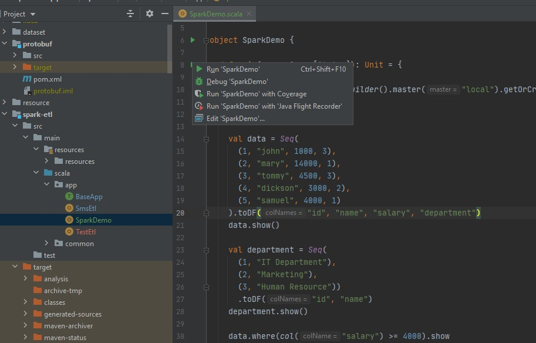

This is a training package made to onboard newcomers and get familiarise with our team's techstack. 
This has been moved to an private repository and will not be maintained.

# Building a Streaming Data Pipeline with NiFi, Spark and Kafka
## 1. Introduction
This is a tutorial on how to build a scalable data pipeline with distributed platforms and processing framework. We will be looking into NiFi, Spark and Kafka.

### NiFi 
NiFi is an open-source platforms that is build for automating the movement of data between disparate systems. It is has supports scalable directed graphs of data routing, transformation, and system mediation logic. We will be using it for perfoming basic transformation and publishing data into Kafka.

### Spark
Apache Spark is an open-source distributed processing system used for big data workloads. It provides an interface for programming clusters with implicit data parallelism and fault tolerance. We will be using it to create a data streaming process that does complex transformation.

Read more at https://tinyurl.com/2p98hskx

### Kafka
Apache Kafka is a distributed event store and stream-processing platform. It can be scaled up for throughput, it has built-in partitioning, replication, and fault-tolerance which makes it a good solution for large scale message processing applications. 

Read more of Spark 2.4 integration with Kafka at https://tinyurl.com/yckmmfky

### Protocol Buffers (Protobuf)
Protobuf is an open-source cross-platform data format used to serialize structured data. It is useful in developing programs to communicate with each other over a network or for storing data. It also support forward and backward compatibility.


## 2. Design Data Pipeline 
We will be designing a data pipeline that processes raw files and transform them into useful records before ingesting into the data warehouse. 

There are several ways to design a data pipeline, and it depends on the goals and considerations. 
In this tutorial, we will focus on designing a streaming data pipeline that will process data in real-time and allows consumer to react and respond to time-sensitive events much quicker than other data processing methods.


We will be using files in `./dataset/sms` as our raw files and `./dataset/reference_dataset` as our lookup dataset for enrichment during ETL.
Transformed data will be ingested into our data warehouse.

## 3. Raw Data and Reference Dataset

The raw data that we will be ingesting and the reference dataset are in CSV format with the following schema

### Raw Data

| field name | data type |
|---|---|
| content | string |
| country | string | 
| recipient | string |
| sender | string |
| timestamp| string |

### Country Dataset

| field name | data type |
|---|---|
| country | string |
| latitude | decimal | 
| longitude | decimal |
| name | string |

### Spam Phone No. Reference Dataset
| field name | data type |
|---|---|
| spamPhoneNo | string |

## 4. Design Data Warehouse (WIP)

There are several ways to design a data warehouse, a Single Flat Table, Star Schema or even Snowflake Schema. However, in this project, we will only use flat table to simplify the work required.

### Data Warehouse Schema

SMS table 

| field name | type | remark |
|---|---|---|
| sender | string | raw sender phone number|
| recipient | string | raw recipient phone number |
| sender_norm | string | normalised sender phone number; remove all non-digit |
| recipient_norm | string | normalised recipient phone number; remove all non-digit |
| sms_timestamp | timestamp | timestamp of when the sms is sent |
| processed_timestamp | timestamp | timestamp of when the etl is processing |
| country | string | short country code |
| country_name | string | full country name |
| latitude | double | latitude of the country |
| longitude | double | longitude of the country |
| content | string | raw content |

Word Count table 

| field name | type | remark |
|---|---| --- |
| word | string | tokernised and normalised to lower case from content |
| spam | boolean | true if the sender is a spam number |
| sms_timestamp | timestamp | round down to 5 min interval |
| frequency | int | count of the word used within the 5 min interval that are either spam or not spam |

### Dimensional Modeling 

As mentioned ealier there are several ways to design a dataware house. And one of the approach is Dimensional Modeling (DM). is a technique that uses Dimensions and Facts to store the data in a Data Warehouse efficiently. It optimises the database for faster retrieval of the data. Dimensional Models have a specific structure and organise the data to generate reports that improve performance. The concept of Dimensional Modelling was developed by Ralph Kimball and consists of “fact” and “dimension” tables. Where facts are the measurements/metrics or facts from your business process. Dimension provides the context surrounding a business process event. 

Read more at https://tinyurl.com/48eyksas


## 5. Building serializing library with Protobuf
In our project, we will use Protobuf to create a schema in Kafka. We need a schema because if the producer starts sending bad data to Kafka or if the data type of your data gets changed. Your downstream consumers will start breaking. We need a way to have a common data type that must be agreed upon. That's where Schema Registry comes into the picture.
We will be using ScalaPB on top of Protobuf to translate Protocol Buffers into Scala case classes so that we can use the features that scala case class provides.

Scalapb example at https://github.com/thesamet/scalapb-maven-example

Following are schemas defined and used by NiFi and Spark to serialize before publishing records into kafka and deserialize when consuming records from kafka 

file: .\protobuf\src\main\protobuf\kafka.proto
```
// for raw record
message Message {
  string schema = 1;
  string content = 2;
}

// for transformed record
message Sms{
  string sender = 1;
  string recipient = 2;
  string sender_norm = 3;
  string recipient_norm = 4;
  google.protobuf.Timestamp sms_timestamp = 5;
  google.protobuf.Timestamp processed_timestamp = 6;
  string country = 7;
  string country_name = 8;
  float latitude = 9;
  float longitude = 10;
  string content = 11;
}

```

## 6. Create Kafka Topic (WIP)

- choosing the right number of partition for scalability

## 7. Implement NiFi Workflow (WIP)
- create nifi workflow; list file, publish record to kafka, move file to archive

## 8. Implement Spark Structure Streaming (WIP)

We will be using Apache Spark to do most of our transformation in our data pipeline.
Apache Spark is an open-source, distributed processing system used for big data workloads. It utilizes in-memory caching, and optimized query execution for fast analytic queries against data of any size.

To use Spark framework, we need to add its artifact into our project dependency `org.apache.spark:spark-core_2.11:2.4.1` & `org.apache.spark:spark-sql_2.11:2.4.1`

### Running Spark Application Basics

#### Run Spark Application in IDE
Run `demo.SparkDemo` using IDE. It imports SparkSession and creates a Dataframe within that session, do transformation and prints out the result. 
while running, visit Spark UI at localhost:4040, click on to the SQL tab to see the queries that the application is running.



#### Run Spark Application from Jar Locally
To run Spark application from a jar, we need to install Apache Spark on our PC
```
spark-submit 
--master local 
--deploy-mode client 
--class demo.SparkDemo  
./spark-etl-1.0-SNAPSHOT.jar
```

WIP............ setup spark binary

#### Run on Cluster - Submit Job to YARN instead of Running in Local
To submit Spark Application onto YARN Cluster, we need to configure the config files; hdfs-site.xml, hdfs-core.xml and yarn-site.xml
This will tell Spark where to find all the necessary resources it needs when running on cluster.
```
spark-submit 
--master yarn 
--deploy-mode cluster 
--num-executors 2 
--driver-cores 2
--driver-memory 1G
--executor-memory 4G
--executor-cores 2
--principal <Kerberos Principle> 
--keytab <Kerberos Keytab>  
--class demo.SparkDemo  
./spark-etl-1.0-SNAPSHOT.jar
```

:exclamation: Choose the number of cores and memory wisely in Production Cluster, as YARN is a shared resource. It may affect other applications that you/others may be running.

WIP............ setup cluster conf

#### Debugging Spark Application with Breakpoint in IDE 
Define environment variable like below
```
export SPARK_SUBMIT_OPTS=-agentlib:jdwp=transport=dt_socket,server=y,suspend=y,address=7777
```
Then create the Debug configuration in Intellij Idea as follows

Run-> Edit Configuration -> Click on "+" left top corner -> Remote -> set port and name

After above configuration run spark application with spark-submit or IDE run and then run debug configruartion that was created just now and add breakpoints/checkpoints to debug.


### Spark Batch Application 

In this section, we will implement a Batch ETL `app.BatchSmsEtl`, that reads CSV SMS records from a directory, enrich it and write the result into a directory
The ETL should enrich SMS records with the reference dataset provided in `./reference_dataset`


##### Run Locally

To run the application we will use the following:
```
spark-submit --master local --deploy-mode client --files ./config.yml --class app.BatchSmsEtl  ./spark-etl-1.0-SNAPSHOT.jar config.yml  BatchSmsEtl
```
##### Run on Cluster 
The jars and files arguments specified in the spark-submit will be uploaded to the application master when a spark job gets submitted to the cluster

WIP............ command to run on cluster? put file in hdfs?

### Spark Structured Streaming

Spark is capable of consuming from Kafka Data Source. Kafka Data Source provides a streaming source and a streaming sink for micro-batch and continuous stream processing in Spark.
It requires the following dependency in the project.
```
org.apache.spark:spark-sql-kafka-0-10_2.11:2.4.1
org.apache.spark:spark-streaming_2.11:2.4.1
```
In this section, we will implement a Streaming ETL `app.StreamingSmsEtl` that reads SMS records from Kafka stream (populated by NiFi), enrich it and write the result into another Kafka Topic.
The behavior should be the same as previous Batch ETL except, it is streaming.

Kafka Data Souce has a fixed schema, to read more: go to https://tinyurl.com/yckmmfky
```
root
 |-- key: binary (nullable = true)
 |-- value: binary (nullable = true)
 |-- topic: string (nullable = true)
 |-- partition: integer (nullable = true)
 |-- offset: long (nullable = true)
 |-- timestamp: timestamp (nullable = true)
 |-- timestampType: integer (nullable = true)
```

WIP............ read from nifi?

##### Aggregation in Structured Streaming

This section we will implement a Streaming ETL that reads SMS records from Kafka stream that we published to previously, then aggregate and writes the Word Count result as CSV into a directory.


WIP............ which directory to write to
